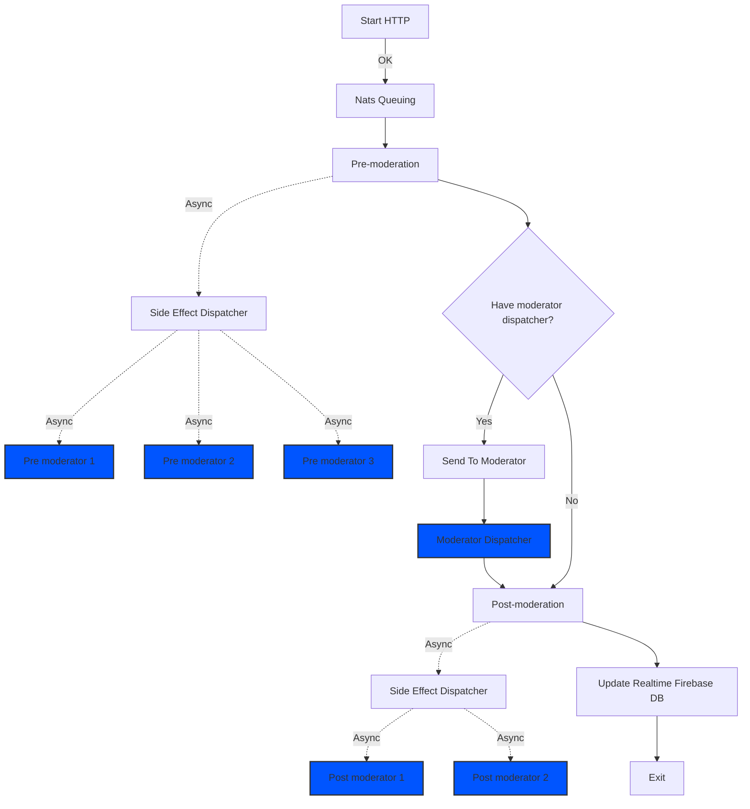

# Messaging Process Flow Documentation

## Overview
This document describes the flow of the messaging process in a chat application, detailing each step from initiation to completion.

## Process Flow

### HTTP Start
- **Description**: The process initiates with an HTTP request to start message processing.
- **Action**: HTTP request received to begin the process.

### Process Message
- **Description**: Processes the incoming message and immediately returns an HTTP OK response (200).
- **Action**: Indicates that the message has been received and the process has begun.

### Pre-moderation Hooks
- **Hooks Involved**:
  - **Pre-mod1**: First level of pre-moderation, possibly for initial validations.
  - **Pre-mod2**: Second level of pre-moderation, possibly for initial filtering.
  - **Pre-mod3**: Third level of pre-moderation, further preparations before moderation.
- **Action**: Asynchronous execution of hooks before message moderation.

### Side Effect Dispatcher
- **Description**: Handles tasks that might include logging or other side operations based on the message content.
- **Action**: Operates after pre-moderation hooks and before sending to the moderator.

### Send to Moderator
- **Description**: The processed message is sent asynchronously to a moderator.
- **Action**: Moderator receives the message for content approval.

### Moderator and Moderator Dispatcher
- **Description**: These components handle the moderation of the message synchronously.
- **Action**: Ensures the content is appropriate before it is further processed or stored.

### Post-moderation
- **Hooks Involved**:
  - **Post-mod1**: Handles tasks like notifications and updates to other systems.
  - **Post-mod2**: Handles additional logging or final operations before updating the database.
- **Action**: Asynchronous execution of hooks after the message has been moderated.

### Update Realtime Firebase DB
- **Description**: Updates the realtime database, such as Firebase, to reflect the moderated content.
- **Action**: The message is stored in Firebase with the moderated content.

### Exit
- **Description**: The process terminates, either after successful completion or if an error occurs at any stage.
- **Action**: End of process flow.

## Endpoints and Hooks

### Endpoints
- **Start Endpoint (HTTP)**:
  - **Description**: Triggered by an HTTP request to begin the message processing.
  - **Response**: Immediate HTTP OK, confirming receipt and start of processing.

### Hooks
- **Pre-moderation Hooks (Pre-mod1, Pre-mod2, Pre-mod3)**:
  - **Description**: Internal functions or services that prepare the message for moderation.
- **Post-moderation Hooks (Post-mod1, Post-mod2)**:
  - **Description**: Operations that occur after the message has been moderated but before the process is completed.

